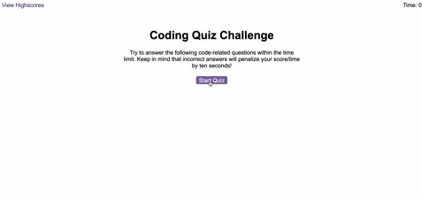

# Code-Quiz

## Project : 

 To build a time coding quiz with multiple-choice questions and the ability to store the high scores to see progress and compare with peers. The quiz app will feature updated HTML and CSS worked by JavaScript code. 

-----
 ## Details :

 * The quiz is presented with a brief introduction to the rules and a 'start quiz' button ready to be clicked and start the timer.

 * Once the start button is clicked the user is presented with a question and a list of four options to select their answer from. 

 * 'Correct' or 'Wrong' will display right below.  If wrong appears than the time will deduct 10 seconds. 

 *  

 -----

 